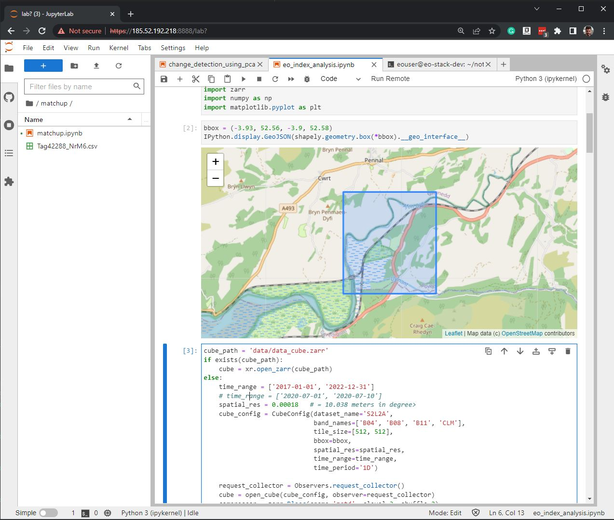

<!-- Global style -->

# **The ECHOES Earth Observation Service**  <!-- fit -->

---

---

---
# The system architecture
#

---

---

<!-- backgroundColor: black -->

---

<!-- backgroundColor: default -->

# The code used in EO Service  

### The Python modules:

eo_io: w/r to object sore
eoian: search and download the input satellite data
eo_custom_scripts: generate results using the Sentinel-Hub API
eo_processors: generate results using satellite data in the object store

**The GitHub repo: [https://github.com/ECHOESProj](https://github.com/ECHOESProj/)**

---

# The code is containerised

#

---

# Jupter Lab on the CREODIAS server

---

<!-- backgroundColor: default -->

# Automation of the servers

#

#

[https://github.com/ECHOESProj/eo-playbooks](https://github.com/ECHOESProj/eo-playbooks)

---

<!-- backgroundColor: black -->

---

<!-- backgroundColor: default -->

# Overview Documentation

https://github.com/ECHOESProj/eo-docs

