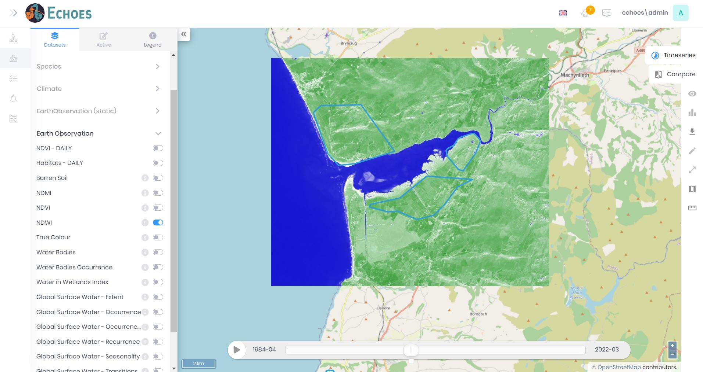
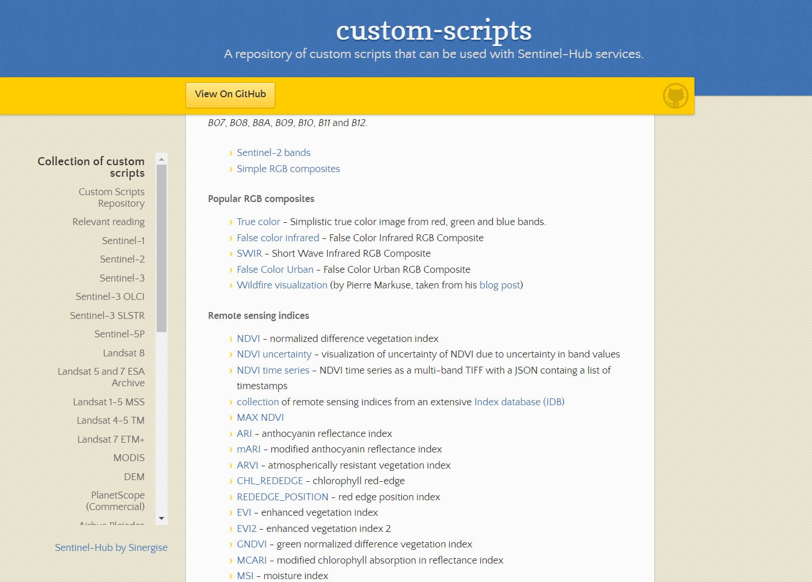
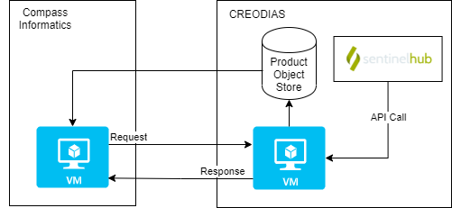
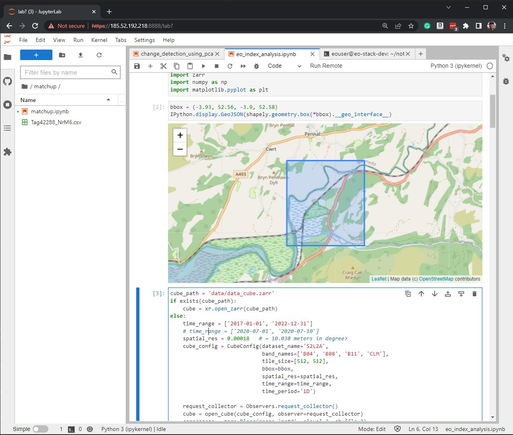

---

theme: dark

---

<!-- Global style -->
<style>
img[alt~="center"] {
  display: block;
  margin: 0 auto;
}
</style>


# **The ECHOES Earth Observation Service**  <!-- fit -->


---



---

[](https://custom-scripts.sentinel-hub.com/#sentinel-2)

---
# The system architecture



* A request is sent to process a given ROI with the given processing script. 
* The processing is done remotely, on a Sentinel-Hub server
* The results (GeoTIFF...) are stored an object store
* The GeoTIFF is transferred to the web-service VM (running GeoServer)    

---

<!-- backgroundColor: black -->


---
<!-- backgroundColor: default -->

# Process Chain for source data

The CREODIAS object store contains over 20 PB of sallite data (stored in e.g. the SAFE format). 

Code has been developed to process data. 

It has a similar interface to the Sentinel-Hub processing chain.

[](https://mermaid.live/edit#pako:eNo1z8GKAjEQBNBfafo0gv7AHITV8S6rsJdc2qR04s4k2ulZWMR_N8J464JXFP1gnwO45YvKradj59JX8w0f8QdS3CcUW9BqtXZp0xwg6ns6Z6UihmGIBgpiMotts9fsUcqcu-ZH38Qy5dMV3qhYViyIeMkjdJQY6vTDJSLH1mOE47aeQfTXsUvP6qZbXcAuxFrl9ixDwZJlsnz4T55b0wkf1EWpb4yzer4AdMdKBQ)

---

<style scoped>
pre {
   font-size: 2rem;
}
</style>

# An example processor 

```cs
#!/usr/bin/env python3

#  Copyright (c) 2022.
#  The ECHOES Project (https://echoesproj.eu/) / Compass Informatics

from os.path import dirname
from satpy import Scene, find_files_and_readers
from shapely import wkt
from eoian import utils
from eoian import command_line_interface


def main(input_file: str, area_wkt: str) -> "Dataset":
    files = find_files_and_readers(base_dir=dirname(input_file), reader='msi_safe')
    scn = Scene(filenames=files)
    scn.load(['B04', 'B08'])
    area = wkt.loads(area_wkt)
    epsg = scn['B04'].area.crs.to_epsg()
    xy_bbox = utils.get_bounds(area, epsg)
    scn = scn.crop(xy_bbox=xy_bbox)
    extents = scn.finest_area().area_extent_ll
    ad = utils.area_def(extents, 0.0001)
    s = scn.resample(ad)

    ndvi = (s['B08'] - s['B04']) / (s['B08'] + s['B04'])
    s['ndvi'] = ndvi
    s['ndvi'].attrs['area'] = s['B08'].attrs['area']
    del s['B04']; del s['B08']
    return s


@command_line_interface.processing_chain_cli(to_zarr=False)
def cli(input_file: str, area_wkt: str):
    return main(input_file, area_wkt)


if __name__ == '__main__':
    cli()
```


---

# The code is containerised


This makes it easier to deploy

The code can be run on a container service, such as K8


---

# Jupter Lab on the CREODIAS server

[](https://185.52.192.218:8888)


---

<!-- backgroundColor: default -->

# Automation of the servers


```cs
- name: Copy shh keys over to eo-processor
  copy:
    src: '{{ item.path }}'
    dest: '{{ ansible_env.HOME }}/echoes-deploy/eo-processors/credentials/'
    remote_src: yes
    owner: '{{ ansible_user_id }}'
    group: '{{ ansible_user_id }}'
    mode: '0700'
  with_items: "{{ ssh_files.files }}"

- name: Build Docker image
  community.docker.docker_image:
    name: '{{ item }}'
    build:
      path: '{{ ansible_env.HOME }}/echoes-deploy/{{ item }}'
      network : host
    source: build
  loop:
    - "eo-custom-scripts"
    - "eo-processors"
    - "websockets-server"

- name: Create a Docker volume
  docker_volume:
    name: el-vol

- name: Run `docker-compose up`
  community.docker.docker_compose:
    project_src: '{{ ansible_env.HOME }}/echoes-deploy/eo-stack/'
    env_file: '{{ ansible_env.HOME }}/env_file'
    files:
      - docker-compose.yml

```

---


<!-- backgroundColor: black -->


---

<!-- backgroundColor: default -->


# The Repos

**Overview Documentation:** https://github.com/ECHOESProj/eo-docs
**Ansible playbook for server provisioning automation:** https://github.com/ECHOESProj/eo-playbooks
**Processors code:** https://github.com/ECHOESProj/eo-processors
**Sentinel-Hub automation code:** https://github.com/ECHOESProj/eo-custom-scripts
**The object store processing chain code:** https://github.com/ECHOESProj/eoian
**Read/write to object store code:** https://github.com/ECHOESProj/eo-io
**Websockets server** https://github.com/ECHOESProj/websockets-server
**Jupyter Notebooks:** https://github.com/ECHOESProj/eo-notebooks
